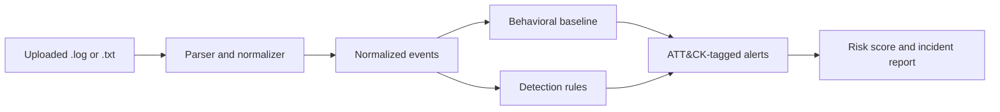

# Sentryline Security Log Analyzer

Sentryline is a portfolio SOC detection workspace for practicing the analyst workflow: upload a mixed security log, normalize it into events, investigate detections, and review the result against a labeled benchmark. It is designed to understand how a SOC analyst reviews a SIEM alert queue, not to replace a production SIEM.

## Problem and architecture

Raw logs mix authentication, web, firewall, endpoint, and data-loss signals. Sentryline converts supported lines into one event model before applying independent detection rules.



The application consists of Flask routes, a standard-library parser, a detection engine, JSON result persistence, and a dashboard/report interface.

## Sample output

On the attached mixed incident log, the current pipeline parsed 129 events, retained one unsupported line as a parser warning, and generated 152 prioritized alerts. Findings included brute force, web exploitation, suspicious IP activity, network scanning, LOLBin execution, privilege escalation, C2 beaconing, and data-exfiltration signals.

## Run locally

```powershell
python -m venv .venv
.\.venv\Scripts\Activate.ps1
pip install -r requirements.txt
python app.py
```

Open `http://127.0.0.1:5000`. The dashboard starts empty. Upload a `.txt` or `.log` file from the **Analyze a log file** panel; it is analyzed immediately and saved under `logs/uploads/`. Results are written to `data/results.json`.

For local Basic Auth protection, configure credentials before starting Flask:

```powershell
$env:SECRET_KEY = python -c "import secrets; print(secrets.token_hex(32))"
$env:SENTRYLINE_AUTH_USER = "analyst"
$env:SENTRYLINE_AUTH_PASSWORD = "change-this-locally"
python app.py
```

When the auth variables are absent, the app remains convenient for local demonstrations. Do not use that mode for a deployed service.

## Log format

The analyzer accepts these common formats:

- Normalized key-value authentication events
- Linux SSH `/var/log/auth.log` lines with `Failed password` or `Accepted password`
- Apache/Nginx combined access-log lines
- One JSON object per line, using fields such as `@timestamp`, `username`, `source_ip`, and `outcome`
- Six-column CSV rows: `timestamp,user,ip,country,action,status`

Normalized example:

```text
2026-09-01T22:14:08Z user=maya ip=185.199.110.42 country=RU action=login status=failed
```

Detection thresholds and the suspicious IP set live in `config.py`. The JSON endpoint is available at `/api/results`.

## Detection logic

- **Brute force:** three or more failed login events from one IP within ten minutes, mapped to `T1110`.
- **Suspicious IP:** source address reputation matching the configured set, mapped to `T1071` for the network signal.
- **Behavioral baseline:** each user needs at least three observed login events. The median login hour and median absolute deviation (MAD) define that user’s normal pattern; an event more than three MADs away, with a two-hour minimum tolerance, is flagged as `T1078`.
- **Privilege escalation:** sudo/user-management activity is normalized for future rule extensions and mapped to `T1548` when detected as an alert.
- **LOLBin execution:** suspicious PowerShell or LOLBin chains are mapped to `T1218`.
- **C2 and exfiltration:** suspicious external activity and large outbound transfers are mapped to `T1071` and `T1041`.
- **Network scanning:** repeated UFW blocked connections are mapped to `T1046`.

Every alert includes severity, confidence, source line, ATT&CK technique ID, technique name, and tactic.

## Evaluation

The repository includes a small labeled benchmark in `tests/`. Run it with:

```powershell
python -c "import csv; from pathlib import Path; from analyzer.parser import parse_log_file; from analyzer.detector import detect; from analyzer.metrics import evaluate_findings; events,_=parse_log_file(Path('tests/evaluation_logs.txt')); labels=list(csv.DictReader(Path('tests/ground_truth.csv').open(encoding='utf-8'))); print(evaluate_findings(detect(events), labels, total_cases=len(events)))"
```

The current benchmark contains 52 lines, 49 parseable events, true negatives, a three-event cold-start boundary, a two-failure borderline case, suspicious success, malformed input, and labels for every detection type. The report shows precision, recall, and false-positive rate per detection type as well as in aggregate. These are benchmark results, not a claim about unlabeled user uploads.

## Detection design rationale

Median plus median absolute deviation (MAD) is used instead of mean plus standard deviation because login-hour data can contain outliers and is not guaranteed to be normally distributed. A minimum of three events prevents a cold-start user from being judged against an empty baseline. A two-hour minimum tolerance avoids overreacting to small clock or scheduling differences. Brute-force detection uses three failures in ten minutes as an intentionally explainable starting threshold, and can be tuned against the labeled benchmark.

ATT&CK techniques describe the behavior represented by each alert: `T1110` for credential guessing, `T1190` for public-facing web exploitation, `T1218` for LOLBin execution, `T1548` for elevation-control abuse, `T1071` for application-layer C2, `T1041` for exfiltration, and `T1046` for scanning. They make the alert queue useful for investigation and reporting rather than just counting strings.

## Iteration story

The initial ruleset used a fixed off-hours rule and produced noisy alerts on late-night activity. The tuned version learns user-specific login patterns and retains only meaningful deviations. The benchmark is versioned in the repository so future threshold changes can be compared against the same labeled cases instead of relying on anecdotal screenshots.

## Scope and limitations

This is an educational detection-engineering project. IP reputation is a local configuration, not a live threat-intelligence feed. Parser support is broad but not universal; vendor-specific formats need a dedicated adapter. Basic Auth is available when `SENTRYLINE_AUTH_USER` and `SENTRYLINE_AUTH_PASSWORD` are configured. Production deployment would still require CSRF protection, rate limiting, a database, retention controls, structured logging, secret management, and a production WSGI server.

## Future work

- Integrate an external or scheduled threat-intelligence blocklist.
- Add incident correlation across user, IP, and time windows.
- Expand labeled data with vendor-specific logs and independent validation.
- Add a hosted demo recording showing upload, dashboard, and report workflows.

## Career context

This project is framed around the SOC analyst workflow: normalize evidence, triage an alert queue, map behavior to ATT&CK, measure detector quality, and explain tradeoffs. It is a practical bridge between SOC operations and penetration-testing study such as eJPT and OSCP preparation.
